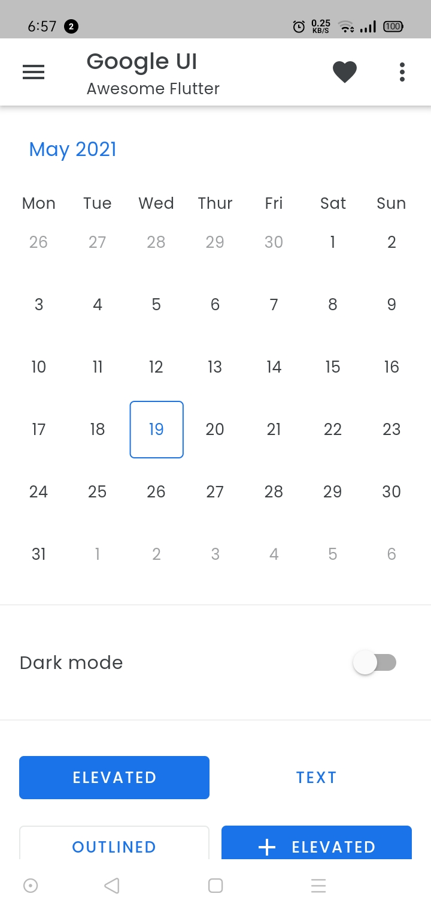
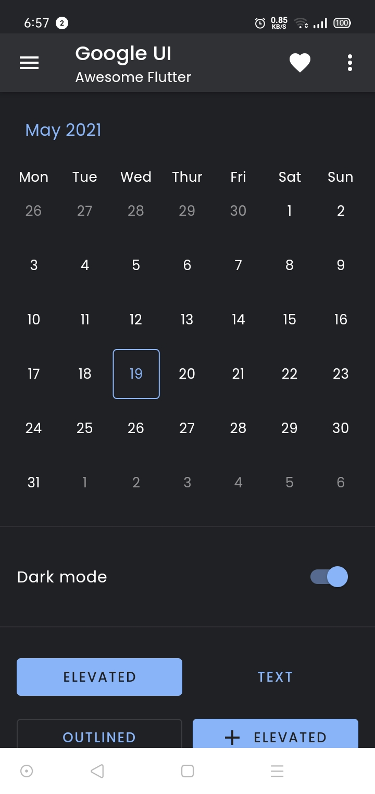

# Google UI
[](https://github.com/edsulaiman/google_ui)
[](https://github.com/edsulaiman/google_ui)
[](https://github.com/edsulaiman/google_ui)
[](https://github.com/edsulaiman/google_ui/releases/)
[](#license)
[](https://github.com/edsulaiman/google_ui/issues)
[](https://github.com/edsulaiman/google_ui)

Flutter UI library using Material Design 2.0.

[Google UI](https://pub.dev/packages/google_ui) is Flutter open-source UI library using [Material Design 2.0](https://uxdesign.cc/previewing-material-design-2-0-ec0215f0588f) with many pre-built widgets to make Flutter development easier and faster.

## Screenshots
|Light mode|Dark Mode|
|:---:|:---:|
|||

## Get the package
To use this package as a library, [pub.dev](https://pub.dev/packages/google_ui/install)

## Font family
Google UI use Poppins as main font family.
- Download [Poppins](https://fonts.google.com/share?selection.family=Poppins:ital,wght@0,300;0,400;0,500;1,300;1,400;1,500)
- Import font to `pubspec.yaml`
``` yaml
fonts:
  - family: Poppins
    fonts:
      - asset: fonts/Poppins/Poppins-Light.ttf
      - asset: fonts/Poppins/Poppins-LightItalic.ttf
        weight: 300
      - asset: fonts/Poppins/Poppins-Regular.ttf
      - asset: fonts/Poppins/Poppins-Italic.ttf
        weight: 400
      - asset: fonts/Poppins/Poppins-Medium.ttf
      - asset: fonts/Poppins/Poppins-MediumItalic.ttf
        weight: 500
```

## Apply the theme to the app
``` dart
import 'package:google_ui/google_ui.dart';
...
class App extends StatelessWidget {
  @override
  Widget build(BuildContext context) {
    const theme = GoogleTheme();

    return MaterialApp(
      title: 'Google UI',
      theme: GoogleThemeGenerator.generate(),
      darkTheme: GoogleThemeGenerator.generateDark(),
      home: const HomePage(),
    );
  }
}
```

## Usage
All Google UI class has `Google` prefix e.g `GoogleButton`

### Available class
- GoogleTheme (Deprecated)
- GoogleThemeGenerator

### Available widget
- GoogleAppBar
- GoogleBottomBar (Deprecated)
- GoogleButton
- GoogleCalendarTimeline
- GoogleCalendar (Deprecated)
- GoogleConditional
- GoogleDateTextFormField
- GoogleDialog
- GoogleDrawer
- GoogleErrorMessage
- GoogleGrid
- GoogleGridBuilder
- GoogleGroupedDrawer
- GoogleIconButton
- GooglePopupMenuButton
- GoogleSearchAppBar
- GoogleSectionTitle
- GoogleMultipleSelectBox
- GoogleSelectBox
- GoogleSwitch
- GoogleTextFormField
- GoogleText

### Available util
- GoogleColorUtil