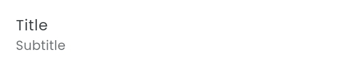
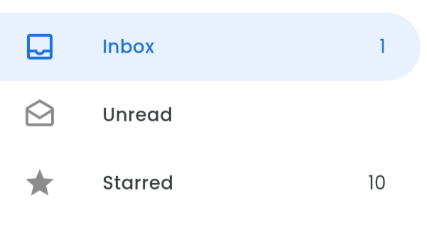
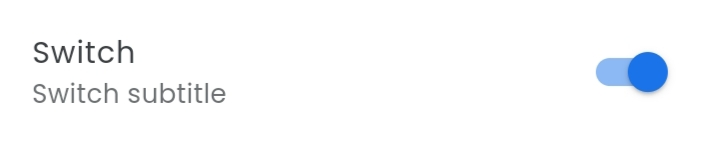
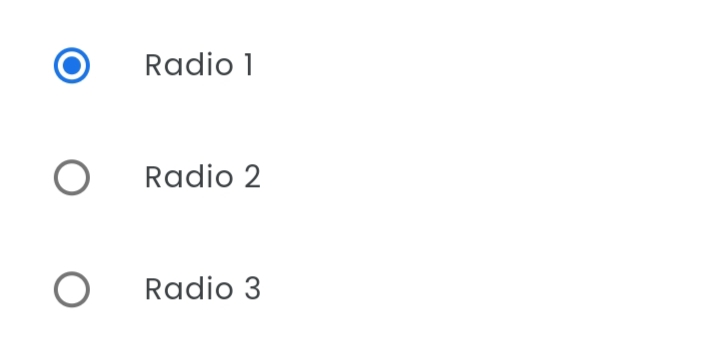
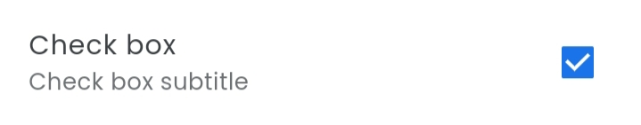
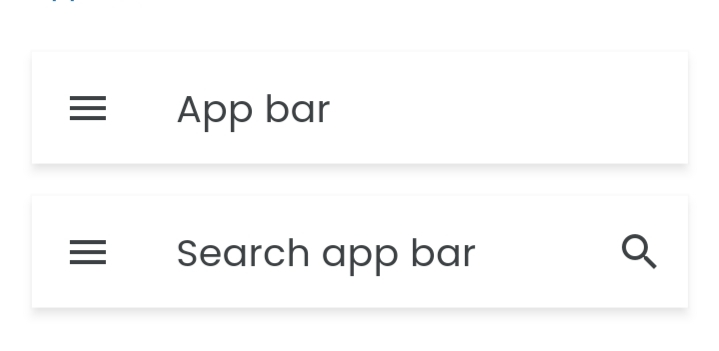
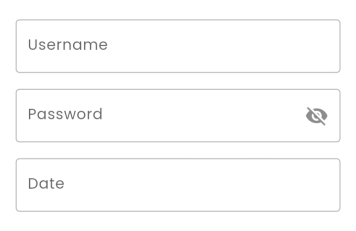
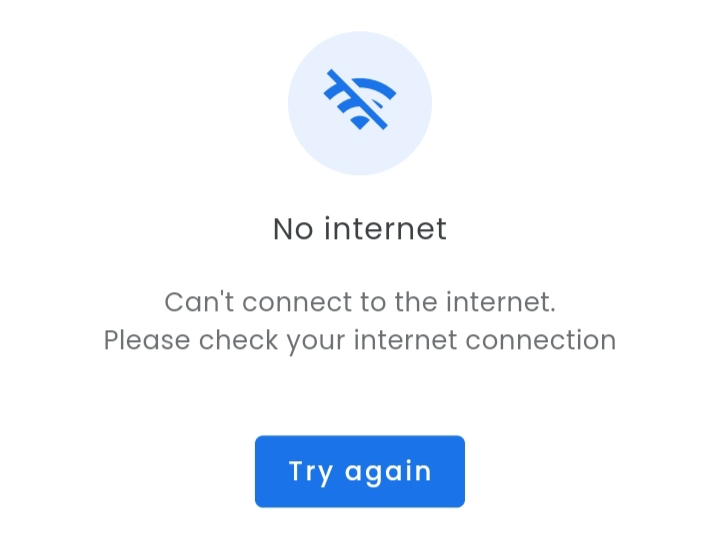
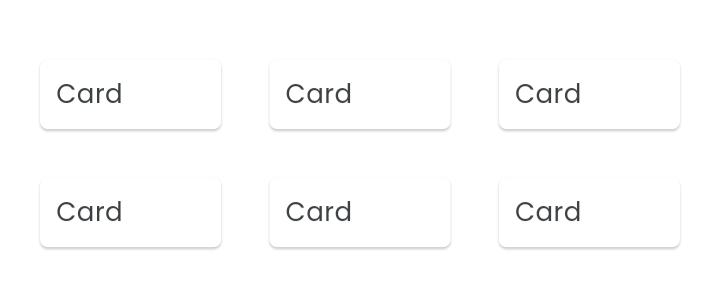
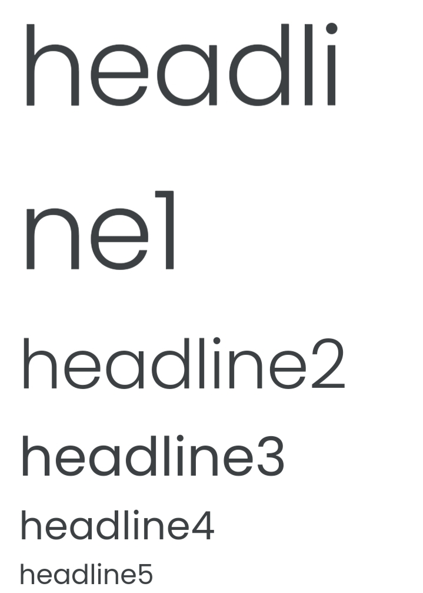

# Google UI

Google UI is an open-source UI library for developing cross-platform apps using Flutter with "Material Design 2.0"

## Table of contents

- [Installation](#instalation)
  - [Setup font](#setup-font)
  - [Install Riverpod](#install-riverpod)
  - [Install Google UI](#install-google-ui)
- [Widgets](#widgets)
  - [Button](#button)
    - [GElevatedButton](#gelevatedbutton)
    - [GTextButton](#gtextbutton)
    - [GOutlinedButton](#goutlinedbutton)
  - [ListTile](#listtile)
    - [GListTile](#glisttile)
    - [GDrawerListTile](#gdrawerlisttile)
    - [GSwitch](#gswitch)
    - [GRadio](#gradio)
    - [GCheckBox](#gcheckbox)
  - [GSelectBox](#gselectbox)
  - [GAppBar](#gappbar)
  - [Field](#field)
  - [GErrorMessage](#gerrormessage)
  - [Grid](#grid)
  - [GText](#gtext)

## Installation

### Setup font

Google UI uses poppins font family as an alternative to product sans

- Download the [font](https://fonts.google.com/share?selection.family=Poppins:ital,wght@0,300;0,400;0,500;1,300;1,400;1,500)
- Import font to pubspec.yaml

```yaml
fonts:
  - family: Poppins
    fonts:
      - asset: fonts/Poppins/Poppins-Light.ttf
      - asset: fonts/Poppins/Poppins-LightItalic.ttf
        weight: 300
      - asset: fonts/Poppins/Poppins-Regular.ttf
      - asset: fonts/Poppins/Poppins-Italic.ttf
        weight: 400
      - asset: fonts/Poppins/Poppins-Medium.ttf
      - asset: fonts/Poppins/Poppins-MediumItalic.ttf
        weight: 500
```

### Install riverpod

Some Google UI widgets is managing the state using [flutter_riverpod](https://pub.dev/packages/flutter_riverpod)

- Follow instalation instruction [here](https://pub.dev/packages/flutter_riverpod/install)
- Replace `main` function in `lib/main.dart` with

```dart
void main() {
  runApp(const ProviderScope(child: App()));
}
```

### Install Google UI

- Follow instalation instruction [here](https://pub.dev/packages/google_ui/install)

- Register the theme

```dart
return MaterialApp(
  title: "YOUR APP TITLE",
  theme: GThemeGenerator.generate(),
  darkTheme: GThemeGenerator.generateDark(),
  home: const HomePage(),
);
```

## Widgets

## Button


### GElevatedButton

```dart
GElevatedButton(
  "Click me"
  onPressed: () {},
);

GElevatedButton(
  "Click me",
  icon: const Icon(Icons.star),
  onPressed: () {},
),

// Equivalent to

ElevatedButton(
  onPressed: () {},
  child: Text("Click me"),
),

ElevatedButton.icon(
  onPressed: () {},
  icon: const Icon(Icons.star),
  label: Text("Click me"),
),
```

### GTextButton

```dart
GTextButton(
  "Click me"
  onPressed: () {},
);

GTextButton(
  "Click me",
  icon: const Icon(Icons.star),
  onPressed: () {},
),

// Equivalent to

TextButton(
  onPressed: () {},
  child: Text("Click me"),
),

TextButton.icon(
  onPressed: () {},
  icon: const Icon(Icons.star),
  label: Text("Click me"),
),
```

### GOutlinedButton

```dart
GOutlinedButton(
  "Click me"
  onPressed: () {},
);

GOutlinedButton(
  "Click me",
  icon: const Icon(Icons.star),
  onPressed: () {},
),

// Equivalent to

OutlinedButton(
  onPressed: () {},
  child: Text("Click me"),
),

OutlinedButton.icon(
  onPressed: () {},
  icon: const Icon(Icons.star),
  label: Text("Click me"),
),
```

## ListTile

### GListTile



```dart
GListTile(
  title: "Title",
  subtitle: "Subtitle",
),

// Equivalent to

ListTile(
  title: Text("Title"),
  subtitle: Text("Subtitle"),
),
```

### GDrawerListTile



```dart
GDrawerListTile(
  leading: const Icon(Icons.inbox_outlined),
  title: "Inbox",
  trailing: const Text("1"),
  selected: true,
  onTap: () {},
),
```

### GSwitch



```dart
GSwitch(
  title: "Switch",
  subtitle: "Switch subtitle",
  value: value,
  onChanged: (value) {},
),
```

### GRadio



```dart
GRadio<int>(
  title: "Radio 1",
  value: 1,
  groupValue: value,
  onChanged: (value) {},
),
```

### GCheckBox



```dart
GCheckBox(
  title: "Check box",
  subtitle: "Check box subtitle",
  value: value,
  onChanged: (value) {},
),
```

## GSelectBox


```dart
GSelectBox<int>(
  value: value,
  items: [
    GSelectBoxItem(
      title: "Select 1",
      value: 1,
    ),
    GSelectBoxItem(
      title: "Select 2",
      value: 2,
    ),
    GSelectBoxItem(
      title: "Select 3",
      value: 3,
    ),
  ],
  onChanged: (value) {},
),
```

## GAppBar



```dart
GAppBar(title: "App bar"),

// App bar with search bar
GSearchAppBar(
  title: "Search app bar",
  hintText: "Search something...",
),
```

## Field



```dart
GTextFormField(labelText: "Username"),

// Password field
GTextFormField(
  labelText: "Password",
  passwordField: true,
),

// Date field
GDateTextFormField(labelText: "Date"),
```

## GErrorMessage



```dart
GErrorMessage(
  icon: const Icon(Icons.wifi_off_outlined),
  title: "No internet",
  subtitle:
      "Can't connect to the internet.\nPlease check your internet connection",
  onPressed: () {},
),
```

## Grid



```dart
// Non scrollable grid
GGrid(
  gap: 16,
  padding: EdgeInsets.all(16),
  columnCount: 3,
  children: [],
)

// Scrollable grid
GGridBuilder(
  gap: 16,
  padding: EdgeInsets.all(16),
  columnCount: 3,
  itemCount: 10,
  itemBuilder: (context,index) =>  child,
),
```

## GText



```dart
GText(
  "headline1",
  variant: GTextVariant.headline1,
),

// variant
// - headline1
// - headline2
// - headline3
// - headline4
// - headline5
// - headline6
// - subtitle1
// - subtitle2
// - bodyText1
// - bodyText2
// - button
// - caption
// - overline
```
